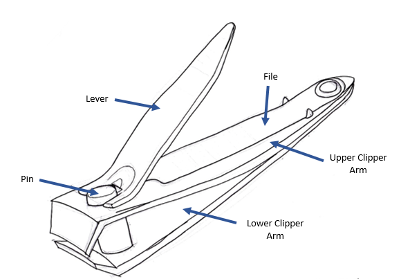
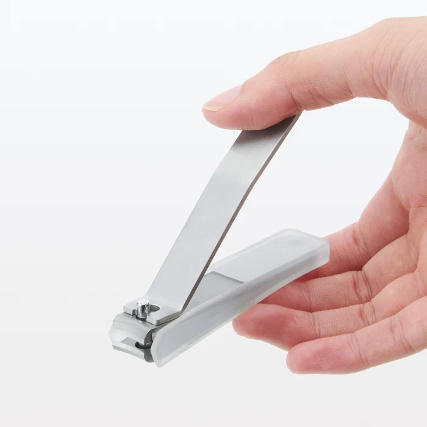

# A1 – [Built Your Professional Portfolio]

## Objective

## Analyze
Task A.)  
**First Portfolio** (Jacob Shankel) - https://github.com/jshank523/jvs-portfolio  
A.) It is reasonable to assume a reader would be able to find a project in sixty seconds on this website, its navigability is great 

B.) It wouldn't be reasonable to assume that a reader could recreate any project from the website upon looking at the projects shown as there isn't enough information for a reader to go upon its reproducibility is not great. 

C.) While a number of the projects on this portfolio do show how decision were made the vast majority do not so one could assume the average reader couldn't find why decisions were made for projects across the site. 

D.) The language used on this website is very professional, the average employer would be happy with this standard.

**Second Portfolio** (Nathan Hoong) - https://nhoong.github.io/
A.) It would be reasonable to assume a reader would be able to find any project Nathan has made in under sixty seconds. 

B.) A reader would not be able to recreate any project shown as the projects don't show enough information for replication. 

C.) No clear reasoning for design choices are shown nor are there any clear steps to show how the final answer was found. 

D.) The language used on this website is professional, it is up to the standard of the average employer. 

Task B.)  

 A.) Primary Engineering Functions: Amplify manual compression initial force through a compound lever system to drive opposing curved edges into a material creating localized shear and compressive failure. 

 B.)  
  i. Model of Compound Mechanical Advantage (MAtot = MAlever x MAcantilever)  
  (MAlever = d effort / d fulcrum)  
  (F blade = Fthumb X MAtotal : net force to the cutting jaws (N))  
  
  ii. One assumption is the cantilever base flexible joint behaves within its linear elastic regime without plastic deformation during full closure.  
  C.)   
    
  Base & Top Frames : Formed from two parallel steel strips spot-welded or riveted at the rear end. The geometry acts as a cantilever leaf spring that keeps the jaws naturally biased open. The distal ends are ground into matching concave arcs.   
     
  The top arm acts as a class-2 lever. Its base features an offset cam profile and notch that hooks onto the central pin, converting rotational thumb pressure into a downward pulling force on the top jaw.  
 D.)  
 Patent Info: US Patent 2,477,782 (W.E. Bassett, 1949).  

i. Alternative Solutions: Scissor-style manicure nippers or a manual flat file/abrasive wheel.  

ii. Key Design Choice: Curved concave cutting edges matching the natural contour of human nails to distribute cutting stress evenly rather than crushing from a single point contact. I believe the original engineer decided to do this to make the clipping of the nails more even for the the user providing a better user experience.  
    
  
  ## Decide 
  Homepage Identity -  
  The average reader must know that I am a student at the University of Charlotte at North Carolina that is important to understanding this homepage and why it is built as such. The homepage layout is unique but it is also not very flexible in design for things that can be changed and cannot. It is organized in a way such that it is easy to find each assignment for my teachers and tas without hassle and in such a way that is appealing to me in a sense as that is what I require any webpage I build to have for myself. This homepage encapsulates all the work done by Atiba Johnson in his sophomore design class.  

  One thing that you may see changed is the added due dates to the assignments, this is necessary to me as I have to be able to see when an assignment is due at a glance so I'm not surprised by due dates later, the old template didn't have this and I like this change.   

  The standard -  
  I intend to make sure my writing reads pleasantly to an average viewer throughout this class as well as my own website and work will grow more unique as I learn more about this class. I intend to put as much effort into this class as I possibly can. 

