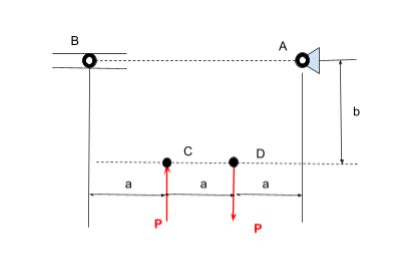
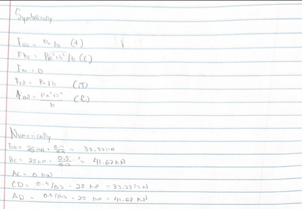
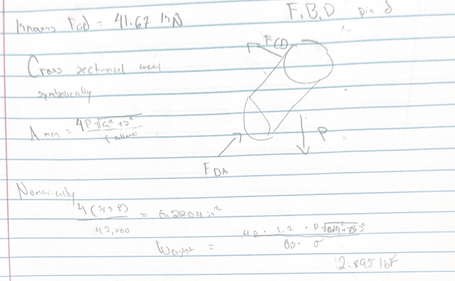
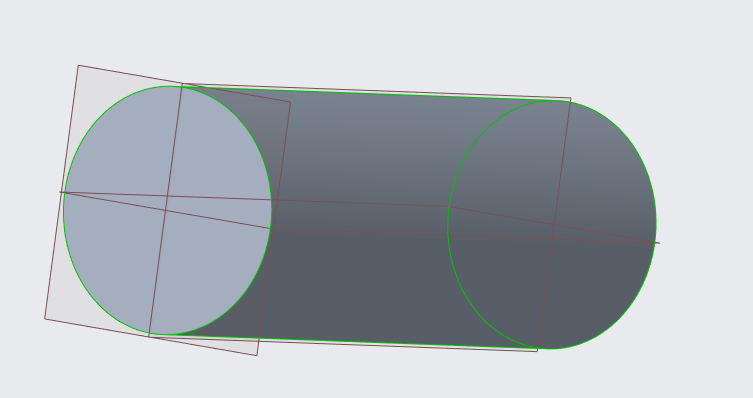
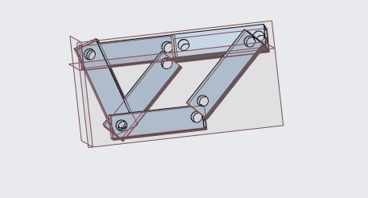

# A2 – Truss Stress Analysis

## Objective -  
This portfolio documentation details comprehensive structural analysis, design, and 3D modeling of a pin-jointed truss system when exposed  to concentrated external loads. The primary objective of this project is to bridge our understanding of statics with practical engineering design by evaluating structural equilibrium, member forces, material yield criteria, and mass optimization. I was tasked with creating a truss design based on set pin locations and as well as two force loads of C and D. Below is a picture of what I was tasked designing.  

  

## Designing The Truss -  
**Lengths**

The design of this truss was focused at its core on stability using the equation for stability I was able to find five members would be required for this truss design. The members lengths are as follows AB is 1.2 meters, CD is 0.4 meters, BC is 0.5 meters, DA is 0.5 meters and lastly CA is 0.854 meters. 

**Freebody Diagram**  
This geometric foundation was established to effectively distribute and support the downward external loads applied at the bottom chord joints. I did the Isolating of each individual joint to provide the necessary framework for applying static equilibrium equations and finding unknown member forces. Free-body diagrams were constructed for every joint by conceptually cutting connecting members and explicitly labeling external reactions alongside internal axial forces. Each diagram mapped out the angular components and reaction vectors, such as Ay = P and By = P, to prepare for the subsequent analytical calculations. Below are pictures of my calculations both symbolically and algebraically. 

    

*second image for clarity of force value*  

  

## Design Shear With A Safety Factor

To determine the minimum cross-sectional area of the connecting pins, we use the maximum internal force from the truss analysis, apply the safety factor, and evaluate against the shear strength of the hardened tool steel. Since a grade of steel wasn't explicitly shown I decided to use grade B for my design. The pictures for how the safety factor was done are also hand written and shown below. The shear was done this way intentionally to create as little deformation as possible within the considerations provided. 

The unknowns for this start was Pins A, B, and The weight of our Pins as at the time we didn't have them. The knowns we had were the values upon each of the members found in the previous steps. Below you can find my equations for how I solved everything and a free by diagram showing the shear force of the object. 

  

## Cad Designs 
 This section details the execution of a 3D solid model using the analytically derived parameters—including a maximum critical load of 41.67kN and a minimum cross-sectional area of 460.1 mm^2 scaled for ASTM A500 Grade B steel under a safety factor of 3.5. By constructing the main truss framework as a single integrated part while incorporating cylindrical pin joints with accurate cross-sectional dimensions, this phase shows the structural integrity, geometric constraints, and mass properties of the entire system.   

    
    
    

Throughout this I learned a lot about how to design a cad system based on parameters assigned, how to use Creo parametric to put together parts, but mainly I learned how to go from a Freebody diagram to a finished design. I think overall this assignment was difficult for me cause of the cad portion and I am not as experienced in the program as I would like to be, but I will take this as a learning experience and do better for my next assignment. 

##Links 
<a href="finished_product.ed" download>Download Final Connections</a>
<a href="pins.prt.1" download>Download Pins</a>

