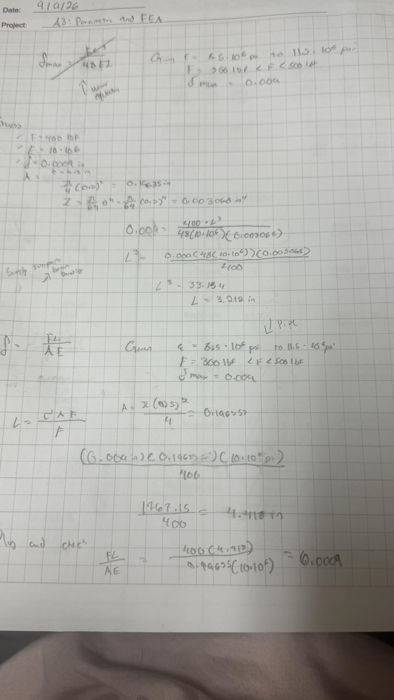
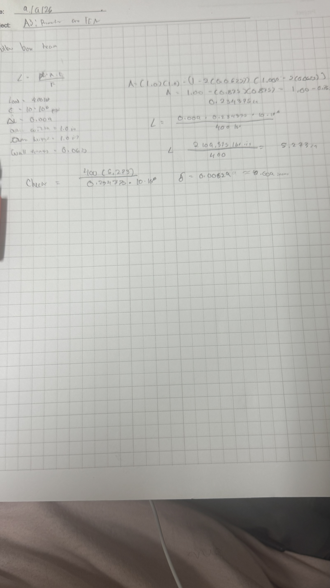
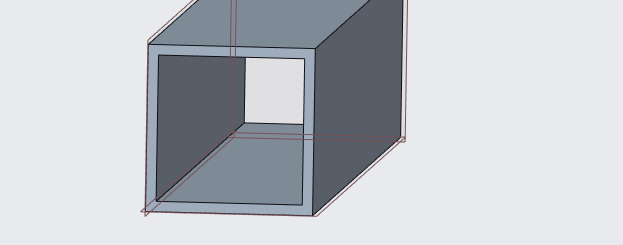
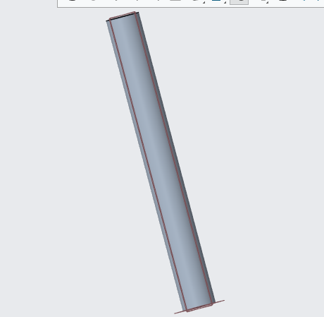
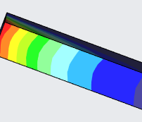

# A3 – [Parametric and FEA]

## Part 1: Design Considerations and Calculations 

In this assignment we were tasked with designing a hollow box beam that would have a maximum deflection of 0.009 inches. To start we were given a load value of 300lbf to 500lbf. The maximum deflection as well as a range for Youngs modulus fromm (8.5-10.5)*10^6 psi.   

I began by using formulas that were given in the book to calculate my beam, this is where my first mistake comes, my mistake is when starting it says of a circular diameter in the canvas page so my first equation was solving for that which would be corrected after seeing the thickness requirement down the line.  

  

Using this work I was able to find a maximum span of 52.73 inches for my design. 

## Part 2: Cad Design  

I would design the model using Creo parametric as my cad software according to the parameters I just created and create a hollow box using an extrusion.
  

Next I would go on to create another extrusion this time to get the length for my beam 
 

## Part 3: Proving the Design 

Next I would have to redownload creo due to my simulation software not being installed in the package the first time, with the help of an staff member I was able to redownload and figure out this issue. 

After the reinstall I would go to simulation and create a FEA for my beam, starting by creating a force for my object as shown below.  
  

Then a constraint would be added to keep the beam as rigid as possible as shown below.  
  

Finally I would change the material to the parameters given and what can be found about the material properties for aluminum as they were required to run the simulation. 
  

## Part 4: Running the simulation FEA 

For my simulation my maximum stress was a lot higher than what would be allowed for aluminum, this is due to my own I assume due to a negligence in calculations or problem with the way I oriented in creo

* Displacement *

* von Mises Stress map*

## Decide

## Communicate

